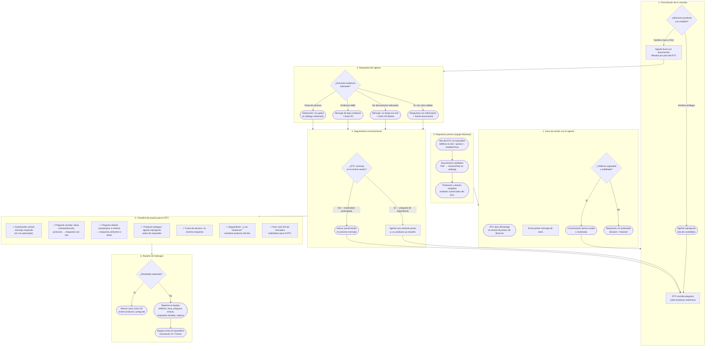

# Guía de pruebas del agente Biomont para RTC

Documento operativo para que los **Representantes Técnicos Comerciales (RTC)** prueben el agente conversacional de Biomont por **WhatsApp**.

**Canal de prueba:** WhatsApp Business de Biomont (número provisto por el equipo).  
**Requisito:** el teléfono del RTC debe estar dado de alta y habilitado en el sistema antes de iniciar las pruebas.

---

## Flujograma del ciclo de uso



> Fuente editable del diagrama: [flujograma-ciclo-rtc-pruebas.mmd](./flujograma-ciclo-rtc-pruebas.mmd)

---

## Resumen del ciclo (6 pasos)

| Paso | Qué hace el RTC | Qué debe ocurrir |
|------|-----------------|------------------|
| **0. Prerrequisitos** | Confirmar con el equipo que su número está habilitado | Sin este paso, el agente responde *“no autorizado”* |
| **1. Inicio** | Abrir WhatsApp y enviar un saludo o pregunta | El agente responde (no bloquea al RTC) |
| **2. Consulta** | Preguntar sobre un producto veterinario | Si el nombre es ambiguo, el agente repregunta |
| **3. Respuesta** | Leer la respuesta del agente | Debe incluir información del catálogo o indicar que no la tiene |
| **4. Seguimiento** | Hacer preguntas de continuación en el mismo chat | El agente recuerda el producto del hilo |
| **5. Checklist** | Ejecutar los 7 casos de prueba de la tabla siguiente | Marcar OK / NO OK por caso |
| **6. Reporte** | Enviar hallazgos al equipo de soporte | El equipo audita en backoffice si hay fallos |

---

## Casos de prueba sugeridos

Ejecutar en orden. Usar el **mismo chat de WhatsApp** para los casos 2–6 (seguimiento conversacional).

| # | Tipo | Pregunta de ejemplo | Resultado esperado |
|---|------|---------------------|-------------------|
| 1 | Autorización | `Hola, quiero consultar sobre un producto` | Respuesta normal (no *“no autorizado”*) |
| 2 | FAQ / balotario | `¿Puede usarse en gestación?` | Respuesta con información + referencia a documento |
| 3 | Dosis | `¿Qué dosis de [producto] le doy a un perro de 25 kg?` | Respuesta con dosis (p. ej. mg/kg) + cita |
| 4 | Protocolo clínico | `¿Cuál es el protocolo para DAPP?` | Respuesta basada en bitácora + cita |
| 5 | Producto ambiguo | `¿Cuánto cuesta el Proteggo?` (sin especificar variante) | Repregunta o mensaje de baja confianza (no inventar) |
| 6 | Fuera de alcance | `¿Cuál es la capital de Francia?` | No responde con datos inventados; indica que no tiene la info |
| 7 | Seguimiento | Tras caso 3: `¿Y en lactancia?` | Mantiene el producto del hilo anterior |

Sustituir `[producto]` por un producto real del catálogo del país del RTC.

---

## Qué significa cada tipo de respuesta

| Respuesta del agente | Significado | Acción del RTC |
|----------------------|-------------|----------------|
| Información + fuente documental | Consulta respondida con evidencia validada | Marcar **OK** |
| *“No tengo esa información…”* + ticket | No hay documentos relevantes en el catálogo | Marcar **NO OK** si la info debería existir; reportar |
| Repregunta de producto | Hay varios productos con nombre similar | Responder aclarando cuál producto |
| *“No estás autorizado”* | Teléfono no registrado o deshabilitado | Contactar al equipo para alta en backoffice |
| Baja confianza + ticket | El agente no está seguro de la respuesta | Reportar con captura de pantalla |

---

## Plantilla de reporte de incidencia

Copiar y completar cuando un caso falle:

```
RTC: [nombre]
Teléfono: [+51...]
Fecha/hora: [DD/MM/AAAA HH:MM]
Producto consultado: [nombre]
Pregunta exacta: [texto copiado de WhatsApp]
Respuesta recibida: [texto copiado de WhatsApp]
Resultado esperado: [qué debería haber respondido]
Captura: [adjuntar screenshot]
```

---

## Notas importantes

1. **Solo mensajes de texto.** El agente no procesa imágenes, audios ni documentos adjuntos en esta versión.
2. **Filtrado por país.** El RTC solo recibe información de los mercados habilitados para su perfil.
3. **El agente no inventa.** Si no encuentra evidencia en documentos validados, crea un ticket y se abstiene.
4. **Pruebas internas del equipo.** Los operadores del backoffice pueden simular conversaciones desde el *playground* sin enviar WhatsApp al RTC; eso es independiente de las pruebas del RTC en canal real.

---

## Referencias técnicas

- Flujo general RTC + backoffice: [flow-rtc-y-backoffice.mmd](./flow-rtc-y-backoffice.mmd)
- Manual operativo backoffice: [manual-usuario-backoffice.md](./manual-usuario-backoffice.md)
- Criterios de aceptación: [spec 001](./specs/001-foundation-v1.md)
