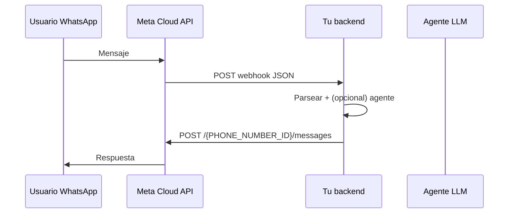

# Briefing: integración Meta/WhatsApp por webhook

Guía para implementar (o replicar en otro proyecto, p. ej. agente de veterinaria) la conexión con **WhatsApp Business Platform (Cloud API)** usando la misma metodología que este repositorio.

## Objetivo

Conectar un backend con WhatsApp para:

1. **Recibir** mensajes de usuarios vía **webhook HTTP** que Meta llama a tu servidor.
2. **Enviar** respuestas vía **Graph API** (HTTP saliente desde tu servidor hacia Meta).

No es WebSocket ni polling: Meta **empuja** eventos al callback; el backend **envía** mensajes con `POST` a `graph.facebook.com`.

**Documentación oficial:**

- [Webhooks overview (WhatsApp)](https://developers.facebook.com/documentation/business-messaging/whatsapp/webhooks/overview/)
- [Send messages (Cloud API)](https://developers.facebook.com/docs/whatsapp/cloud-api/guides/send-messages)

**Referencias en este repo (Biomont):**

| Tema | Archivo |
|------|---------|
| Router GET/POST Meta | `services/agent/src/app/api/whatsapp_router.py` |
| Parseo Cloud API | `services/agent/src/app/services/meta_whatsapp_webhook_parse.py` |
| Envío texto | `services/agent/src/app/integrations/whatsapp_client.py` |
| Pipeline agente + outbound | `services/agent/src/app/agent/orchestrator.py` |
| Spec funcional | `docs/specs/001-foundation-v1.md` |
| Diagramas | `docs/flow-rtc-y-backoffice.mmd` |

---

## Arquitectura (flujo end-to-end)



**Regla de oro:** el webhook solo **notifica**; el envío siempre es una **llamada REST separada** con Bearer token.

---

## Prerrequisitos en Meta (una sola vez)

1. **Meta for Developers** → crear app (tipo Business).
2. Agregar producto **WhatsApp**.
3. Obtener o vincular **WhatsApp Business Account (WABA)** y un **número de teléfono** de prueba o producción.
4. En **WhatsApp → API Setup** (o equivalente según tipo de app), anotar:
   - **Phone number ID** (`PHONE_NUMBER_ID`) — no confundir con el número visible.
   - **WhatsApp Business Account ID** (opcional para otras APIs).
   - **Access token** — idealmente token de larga duración con permisos `whatsapp_business_messaging` (y los que pida el panel).
5. Configurar **Callback URL** y **Verify token** en el dashboard (mismo string que guardarás en el servidor).

El backend debe ser **HTTPS público** (Railway, Fly, Vercel con adapter, etc.). Meta no valida `localhost` sin túnel.

---

## Parte 1: Webhook — suscripción y verificación (GET)

### URL de callback

Recomendado en Biomont: `https://<TU_HOST>/whatsapp/webhook`

En SuplaiSales también se usa `/webhook/v2`; en Biomont el path dedicado es `/whatsapp/webhook` (ver `README.md`).

### Verificación (cuando Meta “Validar y guardar”)

Meta envía un **GET** con query params:

| Parámetro | Valor típico |
|-----------|----------------|
| `hub.mode` | `subscribe` |
| `hub.verify_token` | El token que escribiste en el dashboard |
| `hub.challenge` | Número aleatorio |

**Respuesta correcta del servidor:**

- HTTP **200**
- Body **texto plano** = exactamente el valor de `hub.challenge`
- **Sin JSON**, sin comillas extra, sin wrapper

Implementación en `services/agent/src/app/api/whatsapp_router.py`: usa `secrets.compare_digest` para el token y `PlainTextResponse(hub.challenge)`.

### Variable de entorno (solo verificación GET)

| Variable | Uso |
|----------|-----|
| `WHATSAPP_VERIFY_TOKEN` | Debe coincidir **carácter a carácter** con “Verify token” del panel Meta |

**No confundir** con `WEBHOOK_V2_SECRET`: ese token es para POST con un envelope JSON propio (proxy/n8n). **Meta no envía** `X-Webhook-V2-Secret` en el JSON nativo.

### Prueba manual

```bash
curl -sS -D - -G 'https://TU_HOST/whatsapp/webhook' \
  --data-urlencode 'hub.mode=subscribe' \
  --data-urlencode 'hub.verify_token=TU_TOKEN' \
  --data-urlencode 'hub.challenge=1158201444'
```

Esperado: `200` y body `1158201444`.

### Errores frecuentes en verificación

- Responder JSON en lugar de texto plano.
- Token distinto entre dashboard y servidor (espacios, redeploy sin actualizar env).
- URL en Meta distinta a la que probás con curl (falta `/whatsapp/webhook`).
- Solo configuraste credenciales de envío y no `WHATSAPP_VERIFY_TOKEN`.

---

## Parte 2: Webhook — recibir mensajes (POST)

### Forma del payload nativo Meta

Raíz del JSON:

```json
{
  "object": "whatsapp_business_account",
  "entry": [
    {
      "id": "...",
      "changes": [
        {
          "field": "messages",
          "value": {
            "messaging_product": "whatsapp",
            "metadata": {
              "display_phone_number": "54911...",
              "phone_number_id": "123456789"
            },
            "messages": [
              {
                "from": "54911...",
                "id": "wamid....",
                "timestamp": "1710000000",
                "type": "text",
                "text": { "body": "Hola, quiero un turno" }
              }
            ]
          }
        }
      ]
    }
  ]
}
```

**Autenticación en POST nativo:** en esta metodología **no** se exige header secreto propio en el JSON de Meta; se confía en que solo Meta conoce la URL (fase 2 opcional: validar `X-Hub-Signature-256` con app secret — no está en el MVP de este repo).

### Qué ignorar

- Notificaciones solo de **`statuses`** (entregado/leído) sin `messages[]` → responder **200** con ack, sin ejecutar agente.
- Mensajes `type: "system"`.
- Si vienen varios `messages[]` en un POST, este repo procesa el **primero** y loguea warning.

### Parser (normalización)

Lógica en `app/services/meta_whatsapp_webhook_parse.py`:

- Detectar: `object == "whatsapp_business_account"`.
- Recorrer `entry[].changes[]` donde `field == "messages"`.
- Por cada mensaje de usuario, construir un modelo interno, p. ej.:
  - `provider`: `"meta"`
  - `from_user_id`: `message.from` (wa_id, solo dígitos)
  - `to_agent_phone`: derivado de `metadata.display_phone_number` (normalizar a dígitos) o `phone_number_id`
  - `text`: cuerpo si `type == "text"`; placeholders `[audio]`, `[imagen]`, etc. para otros tipos
  - `provider_message_id`: `message.id` (para **idempotencia** / dedupe)

### Respuesta HTTP al POST de Meta

Meta espera respuesta **rápida** (ideal &lt; 20 s). Patrón recomendado:

1. Responder **200** pronto (ack).
2. Si el agente es pesado, encolar trabajo en background (cola, task async, worker).

En este repo el handler es async y ejecuta el pipeline en la misma request; para un agente con LLM lento, considerar **ack + worker** desde el inicio.

### Modo “solo recepción” (recomendado al inicio)

Variable: `WHATSAPP_WEBHOOK_AGENT_ENABLED=false`

- Valida JSON, parsea, loguea.
- **No** llama al agente ni envía WhatsApp.
- Sirve para validar conectividad sin gastar tokens ni mandar mensajes accidentales.

Ver `docs/specs/001-foundation-v1.md`.

---

## Parte 3: Enviar mensajes (Graph API — saliente)

Meta **no** devuelve la respuesta del agente por el webhook. Hay que llamar:

```
POST https://graph.facebook.com/{VERSION}/{PHONE_NUMBER_ID}/messages
Authorization: Bearer {ACCESS_TOKEN}
Content-Type: application/json
```

Body mínimo (texto):

```json
{
  "messaging_product": "whatsapp",
  "to": "5491112345678",
  "type": "text",
  "text": {
    "preview_url": false,
    "body": "Tu turno quedó agendado para el martes 10:00."
  }
}
```

- `to`: número internacional **sin** `+`, solo dígitos.
- Partir mensajes largos (~3500 caracteres por chunk) si superan límites.

Implementación: `services/agent/src/app/integrations/whatsapp_client.py` → `send_text()`.

### Credenciales de envío

| Dato | Variable / origen |
|------|-------------------|
| Access token | `WHATSAPP_ACCESS_TOKEN` |
| Phone number ID | `WHATSAPP_PHONE_NUMBER_ID` |
| Versión API | `WHATSAPP_GRAPH_API_VERSION` (p. ej. `v19.0`) |

Flag de seguridad: `WHATSAPP_ENABLE_OUTBOUND=false` por defecto. Activar solo cuando el flujo entrante esté probado.

Para **un solo negocio (veterinaria)**, alcanza `WHATSAPP_CREDENTIALS_SOURCE=env`. Multi-tenant usa secretos cifrados en BD (`public.tenant_secrets`). Ver `docs/operations/env-reference.md`.

### Cuándo enviar

Tras procesar el mensaje entrante:

1. Usuario escribe → webhook POST.
2. Agente genera `agent_text`.
3. Si `WHATSAPP_ENABLE_OUTBOUND=true` y `provider in {"whatsapp", "meta"}`:
   - `send_text_message(creds, to=from_user_id, text=agent_text)`.

Referencia: `services/agent/src/app/agent/orchestrator.py` (`_send` / `deliver_whatsapp`).

### Extras opcionales (implementados en este repo)

- **Typing indicator** antes del LLM: `send_typing_indicator` con el `wamid` del mensaje entrante (`WEBHOOK_V2_TYPING_INDICATOR_ENABLED`).
- **Audio/imagen**: descargar media vía Graph y transcribir/vision con OpenAI — `docs/specs/007-webhook-v2-media-openai-typing.md`.

---

## Variables de entorno — mapa mental

| Variable | Fase | Rol |
|----------|------|-----|
| `WHATSAPP_VERIFY_TOKEN` | Setup webhook | GET verify con Meta |
| `WHATSAPP_WEBHOOK_AGENT_ENABLED` | Pruebas | `false` = solo logs/ack |
| `WHATSAPP_APP_SECRET` | POST webhook | Firma HMAC `X-Hub-Signature-256` |
| `WHATSAPP_ACCESS_TOKEN` | Envío | Bearer Graph API |
| `WHATSAPP_PHONE_NUMBER_ID` | Envío | Path `{phone_id}/messages` |
| `WHATSAPP_ENABLE_OUTBOUND` | Envío | `true` para responder por WA |
| `WHATSAPP_GRAPH_API_VERSION` | Envío | p. ej. `v20.0` |

No mezclar tokens; cada uno tiene un propósito distinto. Detalle completo: `.env.example` y `README.md`.

---

## Plan de implementación sugerido (proyecto nuevo, p. ej. veterinaria)

### Fase 0 — Infra

- FastAPI (o equivalente) con ruta pública HTTPS.
- Health check (`GET /health`).

### Fase 1 — Solo webhook

- `GET /webhook/v2` → devolver `hub.challenge`.
- `POST /webhook/v2` → loguear payload, responder `{ "ok": true }`.
- `WEBHOOK_V2_AGENT_ENABLED=false`, `WHATSAPP_ENABLE_OUTBOUND=false`.
- Validar desde el celular con número de prueba de Meta.

### Fase 2 — Parser + agente

- Implementar parser tipo `parse_whatsapp_cloud_inbound_messages`.
- Conectar LLM con system prompt del dominio (turnos, urgencias, horarios).
- Mantener outbound apagado; respuesta solo en logs o API interna.

### Fase 3 — Outbound

- `send_text_message` con credenciales en env.
- `WHATSAPP_ENABLE_OUTBOUND=true`.
- Probar ida y vuelta completa.

### Fase 4 — Producción

- Número real, app en modo Live, plantillas para mensajes proactivos (fuera de ventana 24h).
- Idempotencia por `provider_message_id` si Meta reenvía el mismo evento.
- (Opcional) validar firma `X-Hub-Signature-256`.

---

## Contrato interno mínimo (después del parse)

Independiente del framework, conviene un DTO:

```python
@dataclass
class InboundWhatsAppMessage:
    provider: str          # "meta"
    from_user_id: str      # wa_id del cliente
    to_business_id: str    # teléfono negocio o phone_number_id
    text: str
    provider_message_id: str | None
    raw: dict              # fragmento para debug/dedupe
```

El agente consume `text` + contexto de sesión; el envío usa `from_user_id` como destino `to`.

---

## Checklist para otro agente de código

- [ ] App Meta + producto WhatsApp configurados.
- [ ] `PHONE_NUMBER_ID` y access token guardados de forma segura.
- [ ] Endpoint GET devuelve `hub.challenge` en texto plano con token correcto.
- [ ] Endpoint POST reconoce `object: whatsapp_business_account`.
- [ ] Modo receive-only probado antes de LLM y antes de outbound.
- [ ] Envío por `POST graph.facebook.com/.../messages` con `to` = `from` del mensaje entrante.
- [ ] `WHATSAPP_ENABLE_OUTBOUND` controlado explícitamente.
- [ ] Logs sin tokens ni PII completa.
- [ ] Respuesta webhook &lt; timeout de Meta; considerar cola si el agente es lento.

---

## Diferencias para single-tenant (veterinaria)

No hace falta multi-tenant ni `tenant_secrets` el primer día:

- Un solo `PHONE_NUMBER_ID` + token en env.
- Un solo system prompt y una sola línea de WhatsApp del consultorio.
- `to_agent_phone` puede ser constante o ignorarse si solo hay un número.

La **metodología Meta** (GET verify + POST nativo + Graph API outbound) es la misma que en SuplaiSales; se simplifica la capa de resolución de tenant.
