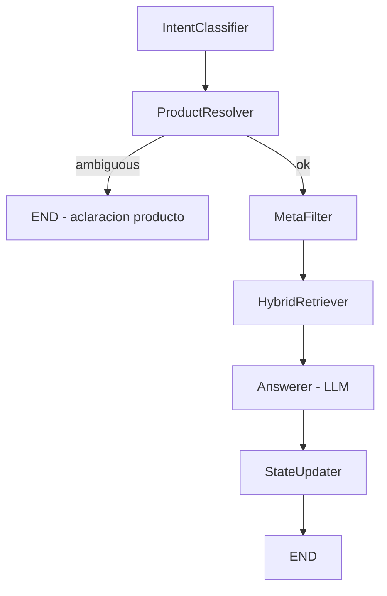

# 007 - Eliminar atajo FAQ, intent `faq` e ingest legacy

> **Supersede parcialmente** la spec [003](./003-langgraph-hybrid-rag-and-knowledge-restructure.md)
> (RF-9, RF-17, partes de RF-22 y del diagrama del grafo) y la spec
> [004](./004-backoffice-products-documents-and-agent-decisions.md) (pestañas FAQ y
> legacy chunks en detalle de documento).

## Contexto y objetivo

La spec 003 introdujo un **atajo de respuesta directa** (`FAQRetriever`) sobre la
tabla `faq_entries`: cuando el intent era `faq` y el score fusionado superaba
`FAQ_DIRECT_THRESHOLD`, el agente devolvía el texto canónico del balotario **sin
invocar al LLM**, saltándose además el `HybridRetriever`.

En producción y pruebas internas ese comportamiento **degrada la experiencia**:
la respuesta suena a copiar/pegar un fragmento encontrado, no a un agente que
razona sobre el contexto recuperado. Biomont ya cuenta con un **retrieval híbrido**
(vector + BM25, filtros por `kind`, producto y país) sobre `knowledge_chunks`
que puede cubrir el balotario vectorizado con la misma calidad que el resto del
corpus.

**Objetivo**: simplificar el pipeline eliminando:

1. La persistencia de **`document_chunks` legacy** y **`faq_entries`** en el ETL.
2. El nodo **`FAQRetriever`** y todo el camino `faq_direct`.
3. La intención **`faq`** del clasificador (no es posible saber de antemano si
   la respuesta vive en un balotario; el híbrido + LLM debe resolverlo).
4. El pipeline LCEL legacy (`RagPipeline` + flag `AGENT_USE_GRAPH`), que dependía
   de `document_chunks` y ya no tiene razón de existir.

El balotario sigue ingresándose como documento `kind='balotario'`, se chunkifica
con `StructuredMarkdownChunker` y sus fragmentos quedan en `knowledge_chunks`.
El acceso a ese contenido ocurre **solo** vía `HybridRetriever` + `MetaFilter`
según la intención real de la consulta.

## Alcance / fuera de alcance

- **En alcance**:
  - ETL: dejar de escribir `document_chunks` y `faq_entries`; eliminar
    `FaqExtractor` del flujo de ingest/reingest.
  - Grafo: quitar `FAQRetriever`; flujo lineal
    `MetaFilter → HybridRetriever → Answerer`.
  - Clasificador: eliminar intent `faq`; actualizar prompt y calibración léxica.
  - `MetaFilter`: quitar rama `Intent.faq`; asegurar que intents clínicos
    relevantes puedan alcanzar chunks de `balotario` cuando corresponda.
  - Orquestador / `Answerer`: quitar ramas `faq_direct`.
  - Backoffice API + web: quitar pestañas/endpoints de FAQ y legacy chunks.
  - Migración DB: eliminar tabla `faq_entries`; dejar de usar `document_chunks`
    (drop de tabla en la misma migración).
  - Tests, golden set, variables de entorno y documentación afectada.
  - Eliminar `AGENT_USE_GRAPH`, `RagPipeline` y wiring asociado en el agente.
- **Fuera de alcance**:
  - Cambiar el algoritmo del `HybridRetriever` (pesos vec/BM25, top-k, etc.).
  - Re-calibrar el `StructuredMarkdownChunker` del balotario (sigue como hoy).
  - Mejoras de calidad del clasificador más allá de quitar `faq` y remapear
    casos que hoy fuerzan gestación → `faq`.
  - Borrar datos históricos de `agent_decisions` que mencionen `faq_direct` en
    trazas pasadas (solo dejan de generarse entradas nuevas).

## Requisitos funcionales

### ETL / ingest

- **RF-1**: `DocumentIngestService` persiste **únicamente**:
  - `document_sections`
  - `knowledge_chunks`
  - metadatos del documento (`documents`, `document_products`, etc.)
- **RF-2**: El ingest **no** invoca `FaqExtractor`, **no** escribe en
  `faq_entries` y **no** escribe en `document_chunks`, para ningún `kind`
  (incluido `balotario`).
- **RF-3**: Reingest (`POST /api/admin/documents/{id}/reingest`) sigue siendo
  idempotente: borra secciones + `knowledge_chunks` del documento y los
  reemplaza; ya no toca `faq_entries` ni `document_chunks` (tablas eliminadas).
- **RF-4**: La respuesta del ingest deja de reportar `faq_entries` y
  `legacy_chunks` como contadores obligatorios (ajustar schema/API si aplica).

### Grafo del agente

- **RF-5**: El grafo compilado **no** incluye el nodo `FAQRetriever`.
- **RF-6**: Tras `MetaFilter`, el flujo es siempre
  `HybridRetriever → Answerer → StateUpdater → END` (salvo producto ambiguo,
  que sigue terminando antes como hoy).
- **RF-7**: `Answerer` **siempre** genera respuesta vía LLM con structured
  output sobre los chunks de `HybridRetriever` (no existe rama de respuesta
  canónica pre-formateada).
- **RF-8**: El estado del grafo (`AgentGraphState`, `GraphOutput`) deja de
  exponer `faq_hits` y `faq_direct_answer`.

### Clasificador de intención

- **RF-9**: Se elimina `Intent.faq` del enum `Intent` y de la taxonomía del
  prompt de `IntentClassifier`.
- **RF-10**: Las consultas que hoy se etiquetan `faq` pasan a intents
  existentes según el foco:
  - gestación / lactancia / contraindicaciones / seguridad de uso →
    `safety_question`
  - dosis, presentaciones, modo de administración → `dosage_question`
  - protocolos terapéuticos → `clinical_protocol`
  - comparativas → `comparison_with_competitor`
  - saludos → `chitchat`
  - fuera de dominio → `out_of_scope`
- **RF-11**: Se elimina la calibración léxica que forzaba gestación/embarazo →
  `faq` (`lexical_gestation_faq_intent` / rama asociada en
  `apply_intent_lexical_calibration`). La calibración de señales de seguridad
  (`lexical_safety_signals_present`) se mantiene.

### MetaFilter (acceso al balotario vectorizado)

- **RF-12**: Se elimina la rama `intent == Intent.faq → [balotario]`.
- **RF-13**: Para que el contenido del balotario siga alcanzable sin intent
  dedicado, `MetaFilter` incluye `DocumentKind.balotario` en:
  - `safety_question` (ya lo incluye hoy)
  - `dosage_question` (hoy: bitácora + ficha; **agregar balotario**)
  - `clinical_protocol` (hoy: solo bitácora; **agregar balotario**)
- **RF-14**: `comparison_with_competitor`, `chitchat`, `out_of_scope` y
  `full_corpus_for_all_intents=true` mantienen el comportamiento actual.

### Agente / orquestación

- **RF-15**: Se elimina el flag `AGENT_USE_GRAPH` y el camino
  `RagPipeline` / `document_chunks`. El agente usa **solo** el grafo.
- **RF-16**: `AgentOrchestrator` deja de tratar `faq_direct_answer` como caso
  especial de `PipelineOutput`.
- **RF-17**: Ninguna decisión nueva registra `reasoning='faq_direct'` ni
  `Answerer.outcome='faq_direct'` en `graph_trace`.

### Backoffice

- **RF-18**: En detalle de documento se eliminan las pestañas **FAQ** y
  **Legacy chunks**.
- **RF-19**: Se eliminan endpoints de listado paginado de `faq_entries` y
  `document_chunks` asociados al documento.
- **RF-20**: La pestaña **Knowledge chunks** (`knowledge_chunks` +
  `document_sections`) sigue siendo la vista de auditoría del retrieval.

### Base de datos

- **RF-21**: Migración versionada elimina `public.faq_entries` y
  `public.document_chunks` (con `.down.sql` que las recrea según definición
  histórica de migraciones 002 y 004 para rollback de esquema, sin restaurar
  datos).

## Requisitos no funcionales

- **RNF-1**: Latencia por turno puede **aumentar levemente** en preguntas que
  antes hacían short-circuit FAQ (se invoca LLM siempre); aceptable a cambio de
  calidad percibida de respuesta.
- **RNF-2**: Costo de ingest **baja**: una sola pasada de embeddings
  (`knowledge_chunks`) y sin llamada LLM de extracción FAQ por balotario.
- **RNF-3**: El grafo queda con **un camino de retrieval**, más simple de
  depurar en `graph_trace`.
- **RNF-4**: Logs/eventos `faq_direct_hit` y `etl_faq_extractor_*` dejan de
  emitirse.

## Criterios de aceptación (Given/When/Then)

- **CA-1 (ETL sin legacy ni FAQ)**
  - **Given** un PDF de cualquier `kind` (bitácora, ficha, balotario),
  - **When** corre el ingest o reingest,
  - **Then** se persisten filas en `document_sections` y `knowledge_chunks`;
    **no** existen inserts en `document_chunks` ni `faq_entries`; no se llama
    al extractor FAQ.

- **CA-2 (Grafo sin FAQRetriever)**
  - **Given** una consulta que antes activaba FAQ direct (p. ej. gestación),
  - **When** el agente procesa el turno con el grafo,
  - **Then** `graph_trace` contiene `HybridRetriever` y `Answerer` con
    `outcome='answered'` (o el outcome habitual del LLM), **no** contiene
    `FAQRetriever`; `retrieved` tiene al menos un chunk cuando hay match en
    balotario.

- **CA-3 (Respuesta generada, no copiada)**
  - **Given** un balotario vectorizado con pregunta sobre gestación,
  - **When** el RTC pregunta *"¿Puede usarse en gestación?"* con producto
    resuelto,
  - **Then** la respuesta es generada por el LLM a partir de chunks
    recuperados; incluye `citations` con `document_id` del balotario; el texto
    **no** es necesariamente idéntico byte-a-byte a una fila de
    `faq_entries` (tabla ya inexistente).

- **CA-4 (Sin intent `faq`)**
  - **Given** el clasificador activo,
  - **When** se envían consultas de catálogo o gestación,
  - **Then** el intent devuelto es uno de la taxonomía sin `faq` (`safety_question`,
    `dosage_question`, etc.).

- **CA-5 (MetaFilter alcanza balotario)**
  - **Given** intent `safety_question` o `dosage_question`,
  - **When** corre `MetaFilter`,
  - **Then** `filter_kinds` incluye `balotario`.

- **CA-6 (Backoffice)**
  - **Given** un documento `validated` con `knowledge_chunks`,
  - **When** un usuario admin abre el detalle,
  - **Then** ve secciones/knowledge chunks; **no** ve pestañas FAQ ni Legacy.

- **CA-7 (Migración)**
  - **Given** la BDD con tablas `faq_entries` y/o `document_chunks` pobladas,
  - **When** se aplica `migrations/007_*.sql`,
  - **Then** ambas tablas dejan de existir; el resto del schema (p. ej.
    `knowledge_chunks`, `products`) permanece intacto; `--down` recrea las
    tablas vacías según definición documentada.

- **CA-8 (Flag legacy eliminado)**
  - **Given** el servicio agent desplegado tras esta spec,
  - **When** se inspecciona configuración,
  - **Then** no existe `AGENT_USE_GRAPH` ni `FAQ_DIRECT_THRESHOLD` en settings
    activos; el arranque no instancia `RagPipeline`.

## Diseño técnico

### Flujo del grafo (nuevo)



### Archivos impactados (referencia)

| Área | Archivos principales |
| --- | --- |
| ETL | `services/backoffice-api/src/app/services/etl_pipeline.py`, `services/backoffice-api/src/app/main.py` (DI FaqExtractor/FaqRepository) |
| Extractor FAQ | **Eliminar** `services/common/src/biomont_common/integrations/faq_extractor.py` y exports |
| Repo FAQ | **Eliminar** `services/common/src/biomont_common/db/faq_repository.py` |
| Grafo | **Eliminar** `services/agent/src/app/agent/graph/nodes/faq_retriever.py`; editar `graph.py`, `state.py`, `nodes/__init__.py`, `nodes/answerer.py`, `nodes/meta_filter.py`, `nodes/intent_classifier.py` |
| Schemas | `services/common/src/biomont_common/schemas/agent_graph.py` (`Intent`), `schemas/knowledge.py` (`FaqHit` a eliminar) |
| Agente | `services/agent/src/app/main.py`, `orchestrator.py`; **eliminar** `rag_pipeline.py` si no queda uso |
| Settings | `services/common/src/biomont_common/settings.py` (`faq_direct_threshold`, `agent_use_graph`) |
| Backoffice API | `documents_router.py`, `document_repository.py`, schemas de ingest |
| Backoffice web | `document-detail-view.tsx`, tipos/fetch relacionados |
| Tests | `test_etl_pipeline.py`, `test_graph_*`, `test_orchestrator.py`, `test_golden_set_eval.py`, `test_document_details_endpoints.py`, `conftest.py` |
| Eval | `evaluation/golden_set.yaml` |
| Skills/docs | `.cursor/skills/clean-biomont-test-data`, `manage-biomont-db`, manuales en `docs/` |

### RAG repository

`RagRepository` conserva métodos sobre `knowledge_chunks` (híbrido). Los métodos
de insert/delete/list sobre `document_chunks` se **eliminan** o quedan sin uso
hasta limpieza en la misma PR.

### Decisiones de diseño

1. **Un solo store de retrieval**: `knowledge_chunks` es la fuente de verdad;
   el balotario es un `kind` más, no una tabla paralela.
2. **Sin intent `faq`**: el clasificador describe *qué tipo de información*
   busca el usuario (dosis, seguridad, protocolo), no *dónde* está almacenada.
3. **Balotario en MetaFilter**: se incluye en intents operativos/clínicos
   (RF-13) para no perder recall en preguntas típicas del balotario sin crear
   un intent artificial.
4. **Drop de tablas legacy**: al dejar de escribir y eliminar el pipeline LCEL,
   mantener tablas vacías solo añade deuda; la migración las elimina.

## Migraciones necesarias

`Migraciones necesarias: **sí**`

- Script: `migrations/007_drop_faq_and_legacy_chunks.sql`
- Rollback: `migrations/007_drop_faq_and_legacy_chunks.down.sql`

### Evidencia de estructura (obtener antes de implementar)

Ejecutar vía skill `manage-biomont-db` o:

```bash
railway run psql -c "
SELECT tablename FROM pg_catalog.pg_tables
WHERE schemaname = 'public'
  AND tablename IN ('faq_entries', 'document_chunks', 'knowledge_chunks')
ORDER BY tablename;
"
```

```bash
railway run psql -c "
SELECT 'faq_entries' AS tbl, COUNT(*) FROM public.faq_entries
UNION ALL
SELECT 'document_chunks', COUNT(*) FROM public.document_chunks
UNION ALL
SELECT 'knowledge_chunks', COUNT(*) FROM public.knowledge_chunks;
"
```

Documentar en el PR los counts pre-migración.

### Contenido esperado de `007` (up)

```sql
-- Orden: faq_entries no depende de document_chunks; ambas son hojas con FK a documents.
DROP TABLE IF EXISTS public.faq_entries;
DROP TABLE IF EXISTS public.document_chunks;
```

### Contenido esperado de `007` (down)

Recrear `document_chunks` según `migrations/002_rag.sql` y `faq_entries` según
`migrations/004_knowledge_restructure.sql` (solo DDL, sin datos).

### Post-migración operativa

- **Reingestar** documentos existentes para repoblar solo `knowledge_chunks`
  (opcional si ya están validados con pipeline 003; obligatorio si faltaban
  chunks enriquecidos).
- Verificar que ningún servicio referencia las tablas eliminadas antes del deploy.

## Plan de pruebas

### Unitarios

- `test_etl_pipeline.py`: ingest balotario persiste knowledge chunks; assert
  cero FAQ y cero legacy; sin mock de FaqExtractor.
- `test_graph_pipeline.py`: eliminar test de short-circuit FAQ; agregar caso
  gestación vía híbrido + answerer.
- `test_graph_nodes.py`: eliminar tests de `FaqRetrieverNode`; actualizar
  MetaFilter e intent classifier (sin `faq`).
- `test_orchestrator.py`: eliminar tests `faq_direct_hit`.
- `test_golden_set_eval.py`: actualizar caso `faq-gestacion-direct` →
  `expected_intent: safety_question` (o `dosage_question` según calibración).

### Integración / HTTP

- Reingest admin: 200 y contadores sin campos FAQ/legacy.
- Detalle documento: 404 o ausencia de rutas `/faq` y `/legacy-chunks`.

### Regresión manual sugerida

1. Ingest balotario Proteggo → inspeccionar knowledge chunks en backoffice.
2. Playground: *"¿Puede usarse Proteggo M en gestación?"* → respuesta LLM con
   cita a documento balotario, tono conversacional.
3. Playground: dosis / protocolo → sin cambio de comportamiento salvo ausencia
   de FAQ direct.

## Observabilidad

- Eliminar eventos: `faq_direct_hit`, `etl_faq_extractor_skipped`,
  `etl_faq_extractor_failed`.
- Mantener: `hybrid_retrieved`, `intent_classified`, `product_resolved`,
  `graph_trace` por nodo.
- Métrica de eval `faq_direct_rate` (spec 003): **eliminar** del golden set eval.

## Riesgos y rollback

| Riesgo | Mitigación |
| --- | --- |
| Pérdida de respuestas “instantáneas” en FAQ muy repetitivas | El híbrido sobre chunks del balotario + LLM debe mantener precisión; monitorear tickets post-deploy. |
| Recall bajo en balotario si MetaFilter excluye `kind` | RF-13 amplía balotario a intents clínicos/operativos; golden set actualizado. |
| Deploy antes de quitar referencias en código → errores SQL | Orden: merge código + migración en mismo release; CI con tests sin tablas FAQ/legacy. |
| Datos históricos en tablas dropeadas | Counts documentados pre-migración; no hay requisito de conservar FAQ estructuradas. |
| Documentos solo con `document_chunks` antiguos | Reingestar corpus antes de retirar flag legacy; verificar `knowledge_chunks` > 0 por doc `validated`. |

### Rollback

1. **Código**: revertir PR (restaura FAQRetriever, ETL dual, tabs BO).
2. **DB**: `railway run ./scripts/apply_migration.sh 007 --down` (recrea tablas
   vacías).
3. **Datos**: reingestar documentos para repoblar `document_chunks` y
   `faq_entries` si se vuelve al comportamiento 003 (solo si rollback de
   producto lo exige).

## Variables de entorno

**Eliminar** de `.env.example` y settings:

- `FAQ_DIRECT_THRESHOLD`
- `AGENT_USE_GRAPH`

**Sin cambios** en `RAG_VECTOR_WEIGHT`, `RAG_BM25_WEIGHT`, `RAG_TOP_K`, etc.

## Coordinación con specs previas

| Spec | Acción |
| --- | --- |
| 003 | Marcar RF-9, RF-17 y diagrama FAQ como **reemplazados** por 007; mantener híbrido, productos, `knowledge_chunks`. |
| 004 | RF-DOC4, RF-DOC5 y pestañas FAQ/legacy **obsoletos**; detalle documento = markdown + secciones + knowledge chunks. |
| 006 | RF-R2 (FaqRepository.search por document_products) **obsoleto** al eliminar FAQ retrieval. |
