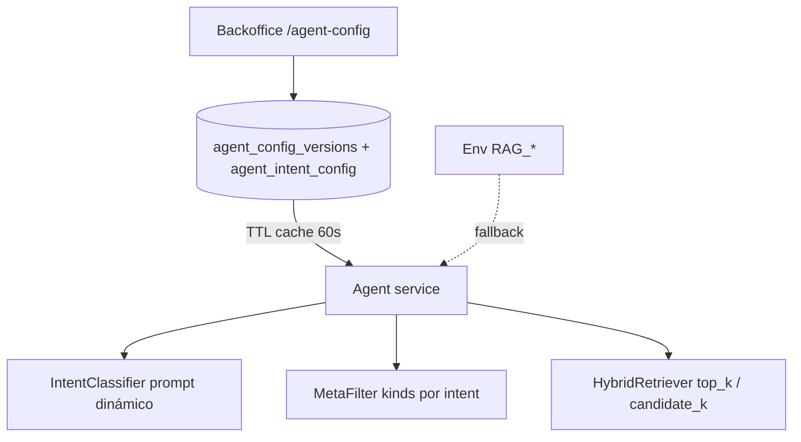

# 008 - Configuración del agente en base de datos (top-k, intenciones y prompts)

## Contexto y objetivo

Hoy el comportamiento del grafo del agente mezcla **variables de entorno** (`RAG_TOP_K`, `RAG_CANDIDATE_K`, pesos híbridos, `RAG_FULL_CORPUS_FOR_ALL_INTENTS`) y **lógica hardcodeada** en código:

- `IntentClassifier`: prompt fijo en `intent_classifier.py`.
- `MetaFilter`: mapa intent → `document_kind[]` en `meta_filter.py`.
- `HybridRetriever`: `top_k` / `candidate_k` desde `RagSettings` (env).

En producción, con `RAG_FULL_CORPUS_FOR_ALL_INTENTS=true`, el intent **no filtra** tipos de documento; aun así, la etiqueta de intent queda en traza y `conversation_state`, y el operador no puede ajustar retrieval sin redeploy.

Auditoría reciente (Imperia): la respuesta correcta estaba en la ficha técnica pero el ranking dependía del texto de la pregunta; subir `top_k` es una palanca operativa que hoy no puede editarse desde el backoffice.

**Objetivo:** persistir en PostgreSQL la configuración operativa del agente — **top-k de retrieval**, **definición de intenciones** (texto para el clasificador y tipos de documento asociados) — editable desde el backoffice con versionado/activación similar a `system_prompts`, y consumida por el servicio `agent` con caché acotada.

**Relación con otras specs:** complementa [003](./003-langgraph-hybrid-rag-and-knowledge-restructure.md) (grafo + retrieval) y [007](./007-remove-faq-shortcut-and-legacy-ingest.md) (taxonomía sin `faq`). No sustituye `system_prompts` (prompt del **Answerer**).

## Alcance / fuera de alcance

### En alcance

- Tablas nuevas versionadas: configuración global de retrieval + filas por intent.
- APIs REST en `backoffice-api` (listar, crear versión, activar, leer activa).
- Pantalla en `backoffice-web` (nueva ruta o sección bajo configuración del agente).
- Carga en runtime del `agent`: `IntentClassifier`, `MetaFilter`, `HybridRetriever` leen la **versión activa** con fallback a env/código actual.
- Semilla inicial (migración o script) que replica el mapa actual de `meta_filter.py` y valores por defecto de `.env.example`.
- Auditoría `bo_audit_log` en mutaciones (activate / create version).
- Tests: repositorio, endpoints HTTP, ensamblado de prompt, MetaFilter con config activa.

### Fuera de alcance (v1 de esta spec)

- Reranker / cross-encoder (spec futura).
- Editar pesos `vector_weight` / `bm25_weight` desde BO (quedan en env salvo extensión explícita en v1.1).
- Nuevos intents dinámicos fuera del enum `Intent` actual (solo configurar los slugs existentes).
- Configuración por RTC o por país (global para todo el tenant).
- Historial diff visual entre versiones (solo listado + activar).
- Cambiar el prompt del Answerer (sigue en `system_prompts`).

## Estado actual (evidencia)

### Tablas relevantes existentes

| Tabla | Uso hoy |
| ----- | ------- |
| `system_prompts` | Prompt del Answerer, versionado, una activa |
| `agent_decisions` | Traza; no configura runtime |
| `conversation_state.last_intent` | Texto libre del slug clasificado |

### Enum `Intent` (código)

`dosage_question`, `clinical_protocol`, `comparison_with_competitor`, `safety_question`, `chitchat`, `out_of_scope` — `services/common/src/biomont_common/schemas/agent_graph.py`.

### Mapa hardcodeado `MetaFilter` (cuando `full_corpus=false`)

| Intent | `document_kind[]` |
| ------ | ----------------- |
| `clinical_protocol` | `bitacora`, `balotario` |
| `dosage_question` | `bitacora`, `ficha_tecnica`, `balotario` |
| `safety_question` | `ficha_tecnica`, `bitacora`, `balotario` |
| `comparison_with_competitor` | `bitacora` |
| resto | `null` (sin filtro por kind) |

### Defaults env (`.env.example`)

- `RAG_TOP_K=6`, `RAG_CANDIDATE_K=25`, `RAG_FULL_CORPUS_FOR_ALL_INTENTS=false`

## Requisitos funcionales

### Modelo de datos

- **RF-1**: Tabla `agent_config_versions` (una fila activa a la vez, patrón `system_prompts`):
  - `id` uuid PK
  - `version` int UNIQUE NOT NULL
  - `is_active` boolean NOT NULL DEFAULT false (índice único parcial: solo una `true`)
  - `top_k` int NOT NULL DEFAULT 6, CHECK `top_k` BETWEEN 1 AND 20
  - `candidate_k` int NOT NULL DEFAULT 25, CHECK `candidate_k` BETWEEN 5 AND 100
  - `full_corpus_for_all_intents` boolean NOT NULL DEFAULT false
  - `classifier_preamble` text NULL — párrafo introductorio opcional del clasificador (dominio veterinario, reglas globales)
  - `created_at`, `created_by` (FK `bo_users`, nullable)
- **RF-2**: Tabla `agent_intent_config` (hijos de una versión):
  - `id` uuid PK
  - `config_version_id` uuid FK → `agent_config_versions` ON DELETE CASCADE
  - `intent_slug` text NOT NULL — debe ser uno de los valores del enum `Intent`
  - `display_label` text NOT NULL — etiqueta humana en BO (ej. "Dosis y uso")
  - `classifier_hint` text NOT NULL — bullet que se inserta en el prompt del clasificador (equivalente a las líneas actuales del `_SYSTEM_PROMPT`)
  - `document_kinds` text[] NOT NULL DEFAULT '{}' — valores del enum SQL `document_kind`; array vacío significa **sin filtro** (`kinds = null` en MetaFilter)
  - `sort_order` int NOT NULL DEFAULT 0
  - `is_enabled` boolean NOT NULL DEFAULT true — si `false`, el slug no aparece en el prompt (el modelo no debería devolverlo; fallback de coerción sigue siendo `out_of_scope`)
  - UNIQUE (`config_version_id`, `intent_slug`)
- **RF-3**: Al **crear** una nueva versión de config, el API clona las filas `agent_intent_config` de la versión activa anterior (o inserta defaults de migración si es la primera).
- **RF-4**: Al **activar** una versión, desactivar las demás en una transacción (misma semántica que `system_prompts`).

### Backoffice API

- **RF-5**: `GET /agent-config/versions` — listado ordenado por `version` DESC (roles: `admin`, `scientist`, `viewer`).
- **RF-6**: `GET /agent-config/active` — versión activa + array de `agent_intent_config` ordenado por `sort_order`.
- **RF-7**: `POST /agent-config/versions` — crea versión nueva (body: `top_k`, `candidate_k`, `full_corpus_for_all_intents`, `classifier_preamble`, `intents[]` con slug, hints, kinds, labels). Rol: `admin` (scientist opcional: alinear con `system_prompts` → solo `admin` para activar; `scientist` puede proponer borrador en v1.1). **v1: mutación solo `admin`.**
- **RF-8**: `POST /agent-config/versions/{version}/activate` — activa versión; `404` si no existe.
- **RF-9**: Validación: `document_kinds` ⊆ `{ficha_tecnica, bitacora, balotario}`; `top_k <= candidate_k` recomendado — si `top_k > candidate_k`, API `422` con mensaje claro.
- **RF-10**: `bo_audit_log` en create y activate (`entity=agent_config_versions`).

### Backoffice web

- **RF-11**: Nueva ruta `/agent-config` (o pestaña en hub "Agente" junto a `/prompts`) con:
  - Bloque **Retrieval**: `top_k`, `candidate_k`, toggle `full_corpus_for_all_intents`, preview de versión activa.
  - Bloque **Intenciones**: tabla editable por fila (label, hint, multiselect o checkboxes de kinds, enabled, orden).
  - Acciones: "Guardar nueva versión" (clona + aplica cambios) y "Activar" en versiones inactivas del historial — reutilizar patrones `ActionFeedbackForm` / `SubmitButton` de [005](./005-backoffice-async-feedback-and-loading-states.md).
- **RF-12**: Entrada en `DashboardNav` (ej. "Config. agente", icono `Sliders` o `Settings2`).
- **RF-13**: Texto de ayuda que explique: `top_k` = chunks que ve el LLM; `document_kinds` = filtro pre-retrieval; `full_corpus` ignora kinds por intent.

### Servicio agent (runtime)

- **RF-14**: Repositorio `AgentConfigRepository` en `biomont_common` (o `services/agent`): `get_active()` con caché TTL configurable (default **60 s**, alineado a `system_prompt_cache_ttl_seconds`).
- **RF-15**: **Precedencia**: si existe versión activa en DB → usar sus valores; si no → fallback a `RagSettings` / mapa hardcodeado actual (compatibilidad bootstrap).
- **RF-16**: `IntentClassifierNode` arma `_SYSTEM_PROMPT` dinámicamente:
  - preamble de DB (o default embebido mínimo)
  - bullets solo de intents `is_enabled=true`, ordenados por `sort_order`
  - reglas fijas de desempate (`out_of_scope` solo temas ajenos; no inventar slugs nuevos)
  - `cache_namespace` incluye `config_version` para invalidar al activar otra versión
- **RF-17**: `MetaFilterNode` recibe mapa `intent_slug → document_kinds[] | None` desde config activa; si `full_corpus_for_all_intents=true` en config activa → todos los kinds (comportamiento actual).
- **RF-18**: `HybridRetrieverNode` / `build_graph` usan `top_k` y `candidate_k` de config activa.
- **RF-19**: Log estructurado al cargar config: `event=agent_config_loaded`, `config_version`, `top_k`, `intent_count`.

## Requisitos no funcionales

- **RNF-1**: Activar nueva config visible en agente en ≤ **60 s** (TTL cache) sin redeploy; documentar que reinicio de pods también aplica de inmediato.
- **RNF-2**: Latencia extra del turno: carga de config en memoria (cache hit) **< 5 ms**; sin query DB por mensaje si cache caliente.
- **RNF-3**: Seguridad: solo usuarios BO autenticados; mutaciones solo `admin`.
- **RNF-4**: Integridad: no borrar versiones referenciadas en audit; soft-delete fuera de alcance — mantener historial append-only.
- **RNF-5**: Sin dependencias nuevas en runtime.

## Criterios de aceptación (Given/When/Then)

- **CA-1 (Persistencia top-k)**
  - **Given** un admin activa `top_k=10` en versión v3,
  - **When** un RTC pregunta al agente tras expirar cache,
  - **Then** `graph_trace` del nodo `HybridRetriever` muestra `count <= 10` y `agent_decisions.retrieved` tiene hasta 10 entradas.

- **CA-2 (MetaFilter desde DB)**
  - **Given** config activa con `full_corpus_for_all_intents=false` e intent `clinical_protocol` con kinds `[bitacora, balotario]`,
  - **When** el clasificador devuelve `clinical_protocol`,
  - **Then** `graph_trace.MetaFilter.payload.kinds` es exactamente `["bitacora","balotario"]`.

- **CA-3 (Prompt de intent desde DB)**
  - **Given** se edita `classifier_hint` de `dosage_question` para mencionar "indicaciones terapéuticas",
  - **When** se activa la versión y se clasifica "Cual es la indicacion de Imperia?",
  - **Then** el intent devuelto es `dosage_question` (eval manual o golden set actualizado).

- **CA-4 (Fallback sin config)**
  - **Given** no hay filas en `agent_config_versions` con `is_active=true`,
  - **When** el agente procesa un mensaje,
  - **Then** usa defaults de env/código idénticos al comportamiento pre-008.

- **CA-5 (Backoffice)**
  - **Given** usuario `viewer`,
  - **When** abre `/agent-config`,
  - **Then** ve valores activos en solo lectura sin botones de guardar/activar.

- **CA-6 (Validación kinds)**
  - **Given** admin envía `document_kinds: ["invalid"]`,
  - **When** POST versión,
  - **Then** API responde `422` sin persistir.

## Diseño técnico

### Migraciones

`Migraciones necesarias: **sí**`

- `migrations/008_agent_config_from_backoffice.sql`
- `migrations/008_agent_config_from_backoffice.down.sql`

Contenido mínimo del `.sql`:

1. Crear tablas RF-1 y RF-2.
2. Insertar versión `1` activa con defaults (mapa meta_filter + top_k=6, candidate_k=25, full_corpus=false).
3. Insertar 6 filas `agent_intent_config` con hints alineados al prompt calibrado post-007 (incluir reglas `out_of_scope` y ejemplo Imperia/indicación).

### Archivos impactados (orientativo)

| Área | Archivos |
| ---- | -------- |
| DB | `migrations/008_*.sql` |
| Common | nuevo `agent_config_repository.py`, schemas Pydantic |
| Agent | `intent_classifier.py`, `meta_filter.py`, `graph.py`, `main.py` (inyección repo) |
| BO API | `agent_config_router.py`, repository admin, schemas |
| BO Web | `app/(dashboard)/agent-config/*`, `dashboard-nav.tsx` |
| Tests | `test_agent_config_*.py`, actualizar golden si hints cambian |

### Diagrama de precedencia

### Convención `document_kinds` vacío vs null

- Array SQL `{}` o `NULL` en migración → en aplicación se interpreta como **sin filtro de kind** (equivalente a rama `else` actual de MetaFilter).

## Plan de pruebas

- Unit: ensamblado de prompt con 0/6 intents habilitados; MetaFilter con full_corpus y sin él.
- Unit: validación Pydantic de kinds y rangos top_k.
- HTTP: create version, activate, get active, 403 viewer, 422 kinds inválidos.
- Integración agent (mock LLM): grafo usa `top_k` de config fake repository.
- Manual: activar `top_k=10`, repetir pregunta Imperia-indicación, comparar `retrieved` en `agent_decisions`.

## Observabilidad

- `agent_config_loaded` (version, top_k, full_corpus, intents_enabled_count).
- `agent_config_cache_hit` / `agent_config_cache_miss`.
- En `graph_trace`, MetaFilter ya expone `kinds`; documentar en manual BO que refleja DB cuando `full_corpus=false`.

## Riesgos y rollback

| Riesgo | Mitigación |
| ------ | ---------- |
| Prompt mal editado degrada clasificación | Versionado + activar anterior; golden set `imperia-indicacion-dosage` |
| `top_k` alto aumenta costo/latencia del Answerer | CHECK máximo 20; ayuda en UI |
| Desincronía enum código vs slug en DB | Validar slugs en API contra `Intent`; migración si se agrega intent en código |
| Cache 60s retrasa cambios | Botón "versión activa" muestra timestamp; doc operativa |

**Rollback:** aplicar `.down.sql` (solo si no hay dependencia operativa), redeploy agent con fallback env, reactivar versión previa desde BO sin down.

## Referencias

- [003](./003-langgraph-hybrid-rag-and-knowledge-restructure.md) — HybridRetriever, MetaFilter
- [007](./007-remove-faq-shortcut-and-legacy-ingest.md) — taxonomía de intents
- [005](./005-backoffice-async-feedback-and-loading-states.md) — UX de formularios BO
- [009](./009-backoffice-catalog-ux-search-and-forms.md) — mejoras UX catálogo (spec separada)
