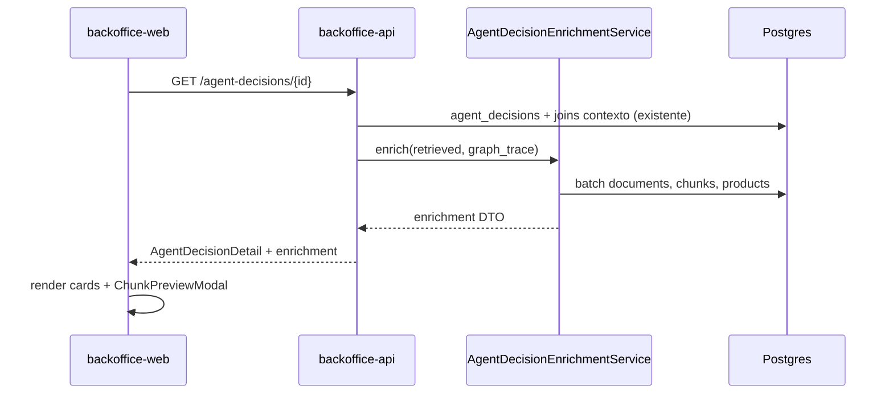

# 010 - Decisiones del agente: navegación atrás, enriquecimiento BFF y vista previa de chunks

## Contexto y objetivo

La spec [004](./004-backoffice-products-documents-and-agent-decisions.md) introdujo la auditoría de `agent_decisions` con detalle que incluye `retrieved` y `graph_trace`. La spec [009](./009-backoffice-catalog-ux-search-and-forms.md) añadió **volver atrás** en catálogo de productos y documentos, pero **no** en decisiones.

Hoy el detalle (`/agent-decisions/[id]`) sigue mostrando **identificadores crudos** (UUID de documento/chunk/producto) y JSON pretty-print, lo que dificulta soporte y revisión científica:

| Sección actual | Problema |
| -------------- | -------- |
| **Retrieved** | Solo `document_id`, `chunk_id`, `similarity` (ver persistencia en `orchestrator.py`) |
| **Graph trace → ProductResolver** | `payload.product_id` sin nombre legible en outcomes `inherited` / `resolved` |
| **Graph trace → HybridRetriever** | `payload.top_scores[].chunk_id` sin etiqueta ni acceso al texto |

El agente **ya conoce** títulos y contenido en runtime (`RetrievedChunk` incluye `document_title`, `content`, etc.), pero al persistir la decisión se guarda un subconjunto mínimo. Por eso el enriquecimiento debe hacerse en **lectura** vía el backoffice-api (patrón **BFF**), resolviendo nombres y contenido desde Postgres (`documents`, `knowledge_chunks`, `products`).

**Objetivo:** hacer el detalle de una decisión **operable** — volver al listado, ver nombres en lugar de UUIDs, y abrir el contenido de un chunk en un modal — sin cambiar el contrato de escritura del agente ni el esquema de `agent_decisions`.

**Relación:** completa RF-D3/RF-D4 de [004](./004-backoffice-products-documents-and-agent-decisions.md) en la parte de legibilidad; reutiliza `CatalogBackLink` de [009](./009-backoffice-catalog-ux-search-and-forms.md).

## Alcance / fuera de alcance

### En alcance

- **RF-NAV:** Botón **volver** (flecha atrás) en `agent-decisions/[id]` → listado `/agent-decisions`.
- **BFF en `backoffice-api`:** enriquecer la respuesta de `GET /agent-decisions/{id}` con campos derivados de DB (sin mutar lo persistido en JSONB).
- **Retrieved (UI):** por ítem: nombre del documento, etiqueta del chunk, similarity; enlaces **Abrir documento** (existente) y **Ver contenido del chunk** (modal).
- **Graph trace (UI):** renderizado por nodo; en **ProductResolver** mostrar nombre de producto; en **HybridRetriever** mostrar etiqueta del chunk en `top_scores` + vista previa del contenido (modal o inline expandible, misma UX que retrieved).
- Tests unitarios del servicio de enriquecimiento y tests HTTP del detalle enriquecido.
- Componentes cliente mínimos para modales (patrón `role="dialog"` ya usado en `confirm-destructive-form.tsx` / `conversations-client.tsx`).

### Fuera de alcance

- Cambiar qué persiste el agente en `retrieved` / `graph_trace` (mejora opcional v2; ver “Evolución futura”).
- Enriquecer el **listado** paginado de decisiones (solo detalle).
- Edición de chunks, re-embed o reingest desde esta pantalla.
- Nueva dependencia npm (modal con markup/CSS existente).
- Migraciones de base de datos.
- Búsqueda/filtros nuevos en la lista de decisiones.

## Estado actual (referencia de código)

| Pieza | Ubicación | Comportamiento |
| ----- | --------- | -------------- |
| Detalle BO web | `services/backoffice-web/app/(dashboard)/agent-decisions/[id]/page.tsx` | JSON crudo + link documento |
| API detalle | `GET /agent-decisions/{id}` → `AgentDecisionDetail` | Pasa `retrieved` / `graph_trace` tal cual desde `AgentDecisionRepository` |
| Persistencia retrieved | `services/agent/.../orchestrator.py` | `{ document_id, chunk_id, similarity }` |
| Trace HybridRetriever | `graph/nodes/hybrid_retriever.py` | `top_scores: [{ chunk_id, vec, bm25, final }]` |
| Trace ProductResolver | `graph/nodes/product_resolver.py` | `product_id` en payload; `ambiguous` ya trae `name` en candidatos |
| Chunks en DB | `knowledge_chunks` | `chunk_index`, `section_type`, `topic`, `content`, … |
| Documentos | `documents.title` | Título legible |
| Productos | `products.name` | Nombre legible |
| Volver atrás (patrón) | `components/catalog-back-link.tsx` | Usado en productos/documentos |

## Requisitos funcionales

### Navegación

- **RF-1:** En el detalle de decisión, mostrar `CatalogBackLink` con `href="/agent-decisions"` y etiqueta **Volver a decisiones** (mismo estilo teal que catálogo).
- **RF-2:** El link debe aparecer **antes** del título H2, coherente con `documents/[id]` y `products/[id]`.

### BFF — contrato API

- **RF-3:** `GET /agent-decisions/{id}` devuelve el detalle actual **más** un objeto `enrichment` (o campos hermanos tipados) con:
  - `retrieved_items[]`: cada elemento alineado por índice con `retrieved[]` persistido.
  - `graph_trace_display[]`: misma longitud/orden que `graph_trace[]`, con `node`, `outcome`, `latency_ms`, `payload` original opcional y **`display`** orientado a UI.
- **RF-4:** Cada `retrieved_items[]` incluye mínimo:
  - `document_id`, `chunk_id`, `similarity` (eco de persistido),
  - `document_title: string | null`,
  - `chunk_label: string` (humano; ver regla de etiqueta),
  - `chunk_content: string | null` (texto completo desde `knowledge_chunks.content` para el modal),
  - `chunk_found: boolean` (false si el UUID no existe — chunk borrado/reingest).
- **RF-5:** Regla **etiqueta de chunk** (`chunk_label`), en orden de preferencia:
  1. `topic` si no vacío,
  2. else `section_type` (+ `subsection_type` si existe, unido con ` · `),
  3. else `Chunk #${chunk_index}`,
  4. prefijo opcional `kind` si ayuda a distinguir: `"${kind} · ${label}"`.
- **RF-6:** Enriquecimiento de **graph_trace** solo en nodos conocidos (v1):
  - **`ProductResolver`:** si `payload.product_id` existe, añadir en `display` `product_name` (desde `products`). Mantener UUID en `payload` para auditoría técnica o mover UUID a tooltip secundario en UI.
  - **`HybridRetriever`:** para cada entrada en `payload.top_scores`, añadir `chunk_label` y `chunk_content` (mismas reglas RF-5/RF-4). No eliminar scores numéricos.
  - Otros nodos (`IntentClassifier`, `MetaFilter`, …): `display` puede ser copia legible del `payload` sin IDs extra.
- **RF-7:** Resolución por **lotes** en el servicio BFF: una query `documents WHERE id = ANY($1)`, una `knowledge_chunks WHERE id = ANY($1)`, una `products WHERE id = ANY($1)` — sin N+1 por ítem.
- **RF-8:** Si `chunk_id` no está en `knowledge_chunks`, intentar fallback **solo lectura** en `document_chunks` (legacy): `chunk_label` = `Chunk legacy #${chunk_index}` y `content` si existe; si tampoco hay fila, `chunk_label = "Chunk no encontrado"` y `chunk_found = false`.
- **RF-9:** No exponer `embedding` ni vectores en la respuesta BFF.

### UI — Retrieved

- **RF-10:** Sustituir el `<pre>` JSON por tarjeta por ítem: título documento, subtítulo `chunk_label`, badge/texto de `similarity`.
- **RF-11:** Mantener **Abrir documento** → `/documents/{document_id}`.
- **RF-12:** Botón **Ver contenido del chunk** abre modal con `chunk_content` (o mensaje si `chunk_found === false`). Texto con scroll (`max-h`, `overflow-y-auto`), `whitespace-pre-wrap`. Cerrar con botón y clic fuera (patrón existente).
- **RF-13:** Si el contenido supera umbral de UI (p. ej. 80 KB), el BFF puede truncar con sufijo `… [truncado]` y el modal muestra aviso; umbral configurable en servicio (constante).

### UI — Graph trace

- **RF-14:** Mantener `<details>` por paso; summary: `Paso N: {node} · {outcome} · {latency_ms}ms`.
- **RF-15:** Cuerpo: tabla o lista legible desde `display` (no JSON crudo por defecto). Toggle opcional **Ver payload técnico** (JSON colapsado) para admins — puede ser `<details>` anidado.
- **RF-16:** En filas de HybridRetriever `top_scores`, mostrar `chunk_label` + botón **Vista previa** que reutiliza el mismo componente modal que RF-12.

### Seguridad y roles

- **RF-17:** Mismos roles que 004: `viewer`, `scientist`, `admin` pueden leer el detalle enriquecido.
- **RF-18:** El contenido del chunk es el mismo dato que ya ve un usuario con acceso a la pestaña “Chunks (retrieval)” del documento; no elevar privilegio.

## Requisitos no funcionales

- **RNF-1:** El enriquecimiento añade como máximo **3 consultas batch** al detalle (documentos, chunks, productos). Latencia objetivo: &lt; 150 ms p95 en DB local con decisión típica (≤6 retrieved + ≤5 top_scores).
- **RNF-2:** Tamaño de respuesta: acotar contenido duplicado — el mismo `chunk_id` en retrieved y en trace debe leerse **una vez** del mapa en memoria en el servicio, no duplicar filas SQL.
- **RNF-3:** Sin nuevas dependencias Python/npm.
- **RNF-4:** Capas: router → `AgentDecisionEnrichmentService` → repositorios/queries en `backoffice-api` (o consultas en adaptador dedicado); **no** SQL en el page de Next.js.
- **RNF-5:** Si falla el enriquecimiento parcial (documento borrado), la API **sigue** devolviendo 200 con campos `null` / `chunk_found: false`; no 500 salvo error de DB.

## Criterios de aceptación (Given/When/Then)

- **CA-1 (volver atrás)**
  - **Given** un usuario autenticado en `/agent-decisions/{id}`,
  - **When** pulsa **Volver a decisiones**,
  - **Then** navega a `/agent-decisions` sin perder sesión.

- **CA-2 (retrieved legible)**
  - **Given** una decisión con `retrieved` que referencia chunks existentes en `knowledge_chunks`,
  - **When** abre el detalle,
  - **Then** ve el **título del documento** y la **etiqueta del chunk** (no solo UUID) y la similitud.

- **CA-3 (modal chunk retrieved)**
  - **Given** un ítem retrieved con `chunk_content` disponible,
  - **When** pulsa **Ver contenido del chunk**,
  - **Then** se abre un modal con el texto del chunk y puede cerrarlo.

- **CA-4 (producto en graph trace)**
  - **Given** un `graph_trace` con nodo `ProductResolver` y `payload.product_id`,
  - **When** abre el detalle,
  - **Then** ve el **nombre del producto** en la vista legible del paso.

- **CA-5 (hybrid top_scores legibles)**
  - **Given** un paso `HybridRetriever` con `top_scores` no vacío,
  - **When** abre el detalle,
  - **Then** cada score muestra **etiqueta de chunk** (no solo UUID) y puede abrir **vista previa** del contenido.

- **CA-6 (chunk huérfano)**
  - **Given** un `chunk_id` en JSONB que ya no existe en DB,
  - **When** abre el detalle,
  - **Then** ve etiqueta de fallback y el modal indica que el contenido no está disponible (sin error 500).

- **CA-7 (API sin regresión de auth)**
  - **Given** petición sin sesión,
  - **When** llama `GET /agent-decisions/{id}`,
  - **Then** recibe `401` como hoy.

## Diseño técnico

### Arquitectura BFF



### Backend (`services/backoffice-api`)

| Archivo (nuevo o modificado) | Responsabilidad |
| -------------------------- | --------------- |
| `app/services/agent_decision_enrichment.py` | Extraer IDs de `retrieved` y `graph_trace`, batch fetch, armar DTOs |
| `app/db/agent_decision_enrichment_queries.py` (opcional) | SQL `ANY($1::uuid[])` para documents/chunks/products |
| `app/schemas/agent_decisions.py` | Modelos `RetrievedItemEnriched`, `GraphTraceStepDisplay`, `AgentDecisionDetailEnrichment` |
| `app/api/agent_decisions_router.py` | Tras `get_decision`, llamar servicio y fusionar en respuesta |

**Esquema de respuesta propuesto (fragmento):**

```python
class RetrievedItemEnriched(BaseModel):
    document_id: UUID
    chunk_id: UUID
    similarity: float | None = None
    document_title: str | None = None
    chunk_label: str
    chunk_content: str | None = None
    chunk_found: bool = True

class GraphTraceStepDisplay(BaseModel):
    node: str
    outcome: str | None = None
    latency_ms: float | None = None
    display: dict[str, Any]  # payload amigable para UI
    payload_raw: dict[str, Any] | None = None  # opcional, para toggle técnico

class AgentDecisionDetail(BaseModel):
    # ... campos actuales ...
    enrichment: AgentDecisionDetailEnrichment
```

**Algoritmo de extracción de IDs:**

1. De cada elemento de `retrieved`: `document_id`, `chunk_id`.
2. De cada paso de `graph_trace` con `node == "HybridRetriever"`: `payload.top_scores[].chunk_id`.
3. De cada paso con `node == "ProductResolver"`: `payload.product_id`; de `payload.candidates[].product_id` si existe (enriquecer nombre si falta `name`).

### Frontend (`services/backoffice-web`)

| Archivo | Cambio |
| ------- | ------ |
| `app/(dashboard)/agent-decisions/[id]/page.tsx` | Server component: `CatalogBackLink`, delegar secciones a client components si hace falta modal |
| `components/agent-decision-retrieved-panel.tsx` (nuevo, client) | Lista enriched + modal |
| `components/agent-decision-graph-trace-panel.tsx` (nuevo, client) | Pasos + preview en HybridRetriever |
| `components/chunk-content-modal.tsx` (nuevo, client) | Modal reutilizable título + contenido |

Tipado: extender el tipo local `AgentDecisionDetail` con `enrichment` devuelto por la API.

**Nota:** si el page debe seguir siendo Server Component, los botones de modal viven en hijos `"use client"` que reciben `chunk_content` / `chunk_label` por props (sin fetch adicional en v1).

### Qué no cambia

- Tabla `agent_decisions` y escritura del agente.
- Endpoint de listado `GET /agent-decisions`.
- RBAC existente.

### Evolución futura (fuera de v1)

- Persistir en el agente `document_title` + `chunk_index` en `retrieved` para auditoría histórica aunque se borre el chunk.
- Endpoint dedicado `GET /knowledge-chunks/{id}/preview` si el detalle crece demasiado (lazy load del modal).

## Migraciones necesarias

`Migraciones necesarias: no`

Solo lectura sobre tablas existentes (`documents`, `knowledge_chunks`, `products`, opcional `document_chunks`).

## Plan de pruebas

### Unitarios (`backoffice-api`)

- `test_agent_decision_enrichment.py`:
  - retrieved con 2 chunks → labels y títulos correctos.
  - `product_id` en trace → `product_name` en display.
  - `HybridRetriever` top_scores → labels alineados.
  - chunk inexistente → `chunk_found=false`.
  - deduplicación: mismo `chunk_id` en retrieved y trace → una sola lectura SQL (mock call count).

### HTTP

- Extender `test_agent_decisions_endpoints.py`: fixture con decisión mock + stubs de enrichment queries → 200 y presencia de `enrichment.retrieved_items[0].document_title`.

### Frontend (mínimo)

- Test de render del panel retrieved con datos fake (opcional si ya hay convención RTL en BO web); prioridad en API.

### Manual

1. Abrir decisión con `answered` y chunks en prod/dev.
2. Verificar nombres y modales.
3. Abrir decisión antigua con chunk borrado → fallback.

## Observabilidad

- Log estructurado en enrichment (nivel `debug`): `decision_id`, `documents_requested`, `chunks_requested`, `chunks_missing`, `products_requested`, `duration_ms`.
- Sin métricas nuevas obligatorias en v1; si `chunks_missing` &gt; 0 con frecuencia, alertar en revisión de reingest.

## Riesgos y rollback

| Riesgo | Mitigación |
| ------ | ---------- |
| Respuesta más pesada (contenido de varios chunks) | Truncar en servicio; típicamente ≤6 + ≤5 textos |
| Chunks legacy solo en `document_chunks` | Fallback RF-8 |
| Producto/documento borrado | UI con “desconocido”; no fallar request |
| Regresión en contrato API | Campo `enrichment` aditivo; `retrieved` / `graph_trace` sin cambios |

**Rollback:** revertir deploy de `backoffice-api` + `backoffice-web`; la UI anterior seguiría mostrando JSON si se revierte solo el front (convivencia breve con API nueva es inofensiva).

## Archivos impactados (checklist implementación)

- [x] `services/backoffice-api/src/app/services/agent_decision_enrichment.py`
- [x] `services/backoffice-api/src/app/db/agent_decision_enrichment_repository.py`
- [x] `services/backoffice-api/src/app/schemas/agent_decisions.py`
- [x] `services/backoffice-api/src/app/api/agent_decisions_router.py`
- [x] `services/backoffice-api/tests/test_agent_decision_enrichment.py`
- [x] `services/backoffice-api/tests/test_agent_decisions_endpoints.py`
- [x] `services/backoffice-web/app/(dashboard)/agent-decisions/[id]/page.tsx`
- [x] `services/backoffice-web/components/agent-decision-retrieved-panel.tsx`
- [x] `services/backoffice-web/components/agent-decision-graph-trace-panel.tsx`
- [x] `services/backoffice-web/components/chunk-content-modal.tsx`

## Referencias

- [004 - Backoffice: productos, documentos y agent-decisions](./004-backoffice-products-documents-and-agent-decisions.md) — RF-D3, RF-D4
- [009 - Backoffice UX: volver atrás](./009-backoffice-catalog-ux-search-and-forms.md) — `CatalogBackLink`
- Persistencia mínima: `services/agent/src/app/agent/orchestrator.py` (lista `retrieved` al insertar decisión)
