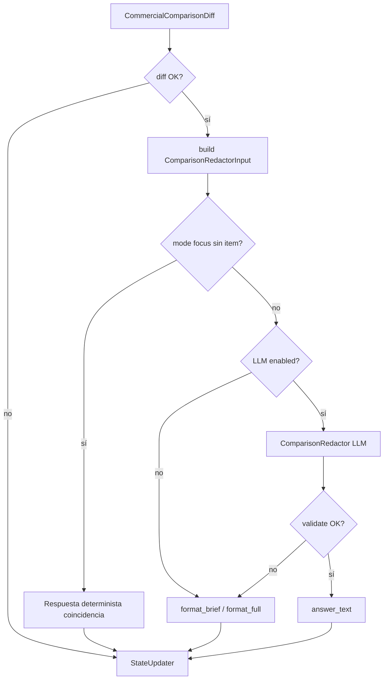

# 013 - Comparador comercial: redacción con LLM (diff determinista)

## Contexto y objetivo

La spec [012](./012-competitor-comparison-hybrid.md) implementó el comparador sobre el cuadro Excel **COMPARATIVO COMERCIAL** (`commercial_comparison_*`): el nodo `CommercialComparisonDiff` calcula diferencias columna a columna y `format_comparison_diff` devuelve **todas** las distincias con el texto íntegro de cada celda.

En uso real (WhatsApp / RTC) eso produce respuestas **muy extensas** (p. ej. MARVO 20 vs Marboxi: 15+ bloques con párrafos de INDICACIONES y PRECAUCIONES) y se percibe como una “lista de Excel”, no como asistencia comercial.

**Objetivo de esta spec:** mantener el **cuadro publicado como única fuente de verdad** (cero invención de datos) y añadir una capa de **redacción con LLM** que:

1. **Priorice** diferencias clínicamente relevantes (fórmula, dosis, especies, forma farmacéutica, indicaciones resumidas).
2. **Resuma** en pocas frases aptas para chat (bullets cortos).
3. **Atienda foco** cuando el usuario pregunte por un eje concreto (“solo dosis”, “en gestación”, “precauciones”).
4. Permita modo **detalle completo** bajo pedido explícito (comportamiento actual o equivalente acotado).

**Relación:** extiende [012](./012-competitor-comparison-hybrid.md) (datos e import/publicación sin cambios). No reemplaza el híbrido RAG + `comparison_facts` de ESPECTRO (sigue fuera de alcance).

## Alcance / fuera de alcance

### En alcance

- Nodo **`ComparisonRedactor`** en el grafo LangGraph, **después** de `CommercialComparisonDiff`.
- Pre-procesamiento **determinista** del `ComparisonDiffResult` (prioridad de columnas, truncado de snippets, detección de foco léxico).
- Prompt y contrato de entrada/salida del LLM (temperature 0, sin juicio de valor).
- Validación **post-LLM** (guardrails): rechazo/regeneración si cita columnas inexistentes o inventa cifras.
- Modos de presentación: `summary` (default), `focus`, `full`.
- Trazabilidad en `graph_trace` y `agent_decisions` (modo, columnas usadas, fallback).
- Feature flag de rollback `AGENT_COMPARISON_LLM_REDACTOR` (default `true` tras deploy).
- Golden set y tests unitarios del pre-procesador y del validador.
- Actualización de casos golden que hoy esperan volcado crudo o mensaje de backoffice incompleto.

### Fuera de alcance (v1 redactor)

- Cambiar import Excel, esquema `commercial_comparison_*` o flujo publicar del BO.
- Matriz ESPECTRO / `comparison_facts` / `CompetitorLookup` de la spec 012 original.
- RAG de `bitacora` / `comparativo` en la misma respuesta (queda spec futura “mixed”).
- Juicio de valor (“mejor”, “recomiendo”, ranking de marcas).
- Comparar más de dos productos en un turno.
- Persistir competidor en `conversation_state` para follow-ups sin re-mencionar (ver **013b** o ampliación v1.1 opcional al final).
- Editar prompts del redactor desde backoffice (v1: constante en código o env; v1.1: fila en `agent_prompt_config`).

## Estado actual (evidencia)

| Componente | Comportamiento hoy |
| ---------- | ------------------ |
| Grafo | `comparison_with_competitor` → `CompetitorResolver` → `CommercialComparisonDiff` → `StateUpdater` (sin LLM) |
| Diff | `ComparisonRepository.diff_rows` — igualdad literal por `column_key` |
| Respuesta | `format_comparison_diff` — lista completa campo a campo |
| Datos | Al menos **Marvo 20** con set publicado v1 `complete` (8 filas, ~22 columnas) |

## Requisitos funcionales

### Pre-procesamiento determinista (sin LLM)

- **RF-1** — Tras `diff_rows`, clasificar cada `ComparisonDiffItem` en **tier** por `column_key` (mapa fijo en código, extensible):

  | Tier | `column_key` (ejemplos) | Rol en resumen |
  | ---- | ----------------------- | -------------- |
  | 1 (destacada) | `formula`, `dosis`, `especies_de_destino`, `f_farmaceutica`, `via_de_adm` | Siempre candidatas al resumen |
  | 2 (contexto) | `indicaciones` | Incluir en resumen con snippet truncado |
  | 3 (metadata) | `producto`, `laboratorio_fabricante`, `pais`, `empresa_importadora` | Omitir del resumen salvo modo `full` o foco explícito |
  | 4 (detalle largo) | `precauciones`, `contraindicaciones`, `reacciones_adversas` (si existen) | Solo bajo foco o modo `full` |

- **RF-2** — **Snippets** para el LLM: por ítem, `subject_snippet` y `competitor_snippet` = primeros **N** caracteres del valor (default **280**), con sufijo `…` si se truncó. El diff completo sigue en memoria/traza para modo `full`.

- **RF-3** — **Modo de presentación** (`presentation_mode`), resuelto en orden:

  1. **`focus`** — si la query contiene léxico mapeado a un `column_key` (tabla de sinónimos: dosis, fórmula/formula, especie, indicación, precaución, contraindicación, vía, laboratorio, país, etc.).
  2. **`full`** — si la query contiene: `todo`, `completo`, `todas las diferencias`, `listame todo`, `detalle completo`.
  3. **`summary`** — en cualquier otro caso con diff no vacío.

- **RF-4** — Construir **`ComparisonRedactorInput`** (JSON serializable, ver diseño):

  - Metadatos: `subject_name`, `competitor_name`, `published_version`, `presentation_mode`, `focus_column_key` (nullable).
  - `highlight_items[]`: máximo **5** ítems tier 1–2 (orden: tier asc, luego `sort_order` del Excel).
  - `other_items_count`: cantidad de diferencias no incluidas en highlights.
  - `items[]`: lista enviada al LLM según modo (focus: 0–1 ítem; summary: highlights; full: todos con snippets truncados tier 4 incluidos).

- **RF-5** — Si `presentation_mode = focus` y no hay diff en esa columna → **no llamar LLM**; respuesta determinista: *"En el cuadro comparativo, {columna} coincide entre ambos"* o *"No hay dato de {columna} para comparar"*.

### Redacción con LLM

- **RF-6** — Nodo **`ComparisonRedactor`**:

  - Entrada: `ComparisonRedactorInput` + `query` original (para tono, no para inventar datos).
  - Salida: `answer_text` (markdown ligero, ≤ **12** líneas en modo `summary`).
  - Modelo: el mismo `chat_model` del grafo; **temperature = 0**.
  - Si `AGENT_COMPARISON_LLM_REDACTOR=false` → saltar nodo y usar `format_comparison_diff` / `format_comparison_diff_brief` determinista (fallback).

- **RF-7** — **System prompt** (obligaciones):

  - Usar **solo** los valores de `items[]`; no añadir competidores, dosis ni indicaciones no presentes.
  - **Sin juicio de valor** (prohibido: mejor, peor, recomiendo, más eficaz).
  - Modo `summary`: abrir con una línea de contexto; luego **3–5 bullets** con las diferencias más relevantes; cerrar con: *"Hay {other_items_count} diferencias más en el cuadro (ej. precauciones). Preguntá por un tema concreto: dosis, fórmula, precauciones…"*
  - Modo `focus`: 1–2 párrafos cortos solo sobre esa columna, citando ambos productos.
  - Modo `full`: organizar por secciones usando `header_label`; puede ser más largo pero sin repetir texto idéntico.
  - Cierre obligatorio: *"Fuente: comparativa comercial Biomont (v{version})."*

- **RF-8** — **Structured output** (recomendado v1): respuesta del modelo en JSON:

  ```json
  {
    "opening": "string",
    "bullets": [{"column_key": "dosis", "text": "string"}],
    "closing_hint": "string | null",
    "footer": "string"
  }
  ```

  El runtime arma `answer_text` desde el JSON. Si el parse falla → un reintento; luego fallback determinista.

### Guardrails post-LLM

- **RF-9** — **Validador determinista** (`validate_redactor_output`):

  - Cada `bullets[].column_key` debe existir en `items[]` del input.
  - Ningún bullet puede contener números mg/ml/% **que no aparezcan** en los snippets del ítem correspondiente (regex de tokens numéricos; tolerancia: mismos números con distinto formato).
  - Palabras bloqueadas: lista configurable (`mejor`, `peor`, `recomiendo`, `superior`, `inferior`, …) → si aparecen, fallback o regeneración única.

- **RF-10** — Si validación falla tras reintento → **`format_comparison_diff_brief`** (plantilla determinista: solo tier 1–2 truncados + hint de más diferencias). Registrar en trace `outcome: fallback_deterministic`.

### Grafo y enrutamiento

- **RF-11** — Flujo actualizado:

  ```
  comparison_with_competitor
    → ProductResolver
    → CompetitorResolver
    → (repregunta / error set) → StateUpdater
    → CommercialComparisonDiff
    → (sin diff / error) → StateUpdater
    → ComparisonRedactor   # nuevo
    → StateUpdater
  ```

- **RF-12** — `CommercialComparisonDiff` deja de setear `answer_text` final en éxito; guarda en estado:

  - `comparison_diff` (serializado o campos planos),
  - `comparison_diff_version`,
  - deja `answer_text = null` hasta el redactor.

  Excepción: errores (`no_set`, `incomplete_set`, `competitor_row_missing`) siguen con respuesta determinista directa (sin LLM).

- **RF-13** — `structured_response = true` en todos los caminos de comparación estructurada.

### Observabilidad y auditoría

- **RF-14** — `graph_trace` en `ComparisonRedactor`:

  - `presentation_mode`, `focus_column_key`, `items_sent`, `highlight_count`, `other_items_count`, `llm_used`, `validation_passed`, `outcome`.

- **RF-15** — Opcional en `agent_decisions.retrieved` o `decision`: payload compacto `{ "comparison_redactor": { ... } }` sin volcar celdas completas (solo keys + hashes de snippet).

## Requisitos no funcionales

- **RNF-1** — Latencia p95 adicional del redactor ≤ **2,5 s** (1 llamada LLM, sin RAG).
- **RNF-2** — Costo: máximo **1** llamada por turno de comparación (reintento cuenta como 2ª solo en fallo de parse/validación).
- **RNF-3** — Trazabilidad reproducible: guardar en trace el `ComparisonRedactorInput` (sin PII del RTC).
- **RNF-4** — Idioma de salida: español (Rioplatense neutro profesional), salvo query explícita en inglés.
- **RNF-5** — Cumplir regla de capas: el redactor no accede a SQL; solo consume el diff ya calculado.

## Criterios de aceptación (Given/When/Then)

- **CA-1 (resumen corto)**
  - **Given** set publicado `complete` Marvo 20 vs fila Marboxi con ≥10 diferencias,
  - **When** `"MARVO 20 versus Marboxi diferencias"`,
  - **Then** respuesta ≤ 12 líneas, menciona al menos **dosis** y **fórmula**, incluye hint de más diferencias, footer con versión del cuadro, sin palabras de juicio de valor.

- **CA-2 (foco dosis)**
  - **Given** mismo set,
  - **When** `"MARVO 20 vs Marboxi solo en dosis"`,
  - **Then** respuesta trata principalmente DOSIS; no lista laboratorio/país salvo que estén en el mismo bullet por error (validador no exige vacío pero ≤ 6 líneas).

- **CA-3 (foco sin diferencia)**
  - **Given** par donde columna `pais` es idéntica en ambas filas (no está en `differences`),
  - **When** `"comparar Marvo 20 con Marboxi en país"`,
  - **Then** mensaje determinista de coincidencia o sin dato; **no** llamada LLM.

- **CA-4 (modo completo)**
  - **Given** set con muchas diferencias,
  - **When** `"listame todas las diferencias entre MARVO 20 y Marboxi"`,
  - **Then** respuesta incluye todas las columnas diferenciadas (LLM o fallback `format_comparison_diff`), trace con `presentation_mode=full`.

- **CA-5 (guardrail alucinación)**
  - **Given** mock LLM que devuelve "50 mg/kg" no presente en snippets,
  - **When** validación post-LLM,
  - **Then** `outcome=fallback_deterministic` y respuesta brief sin el número inventado.

- **CA-6 (set incompleto — sin cambio)**
  - **Given** set `incomplete` o sin publicar,
  - **When** comparación,
  - **Then** mensaje de catálogo incompleto desde `CommercialComparisonDiff`; **ComparisonRedactor** no se ejecuta.

- **CA-7 (feature flag off)**
  - **Given** `AGENT_COMPARISON_LLM_REDACTOR=false`,
  - **When** comparación exitosa,
  - **Then** respuesta usa plantilla determinista brief/full sin llamada LLM.

- **CA-8 (competidor faltante — sin cambio)**
  - **Given** competidor no en cuadro,
  - **When** comparación,
  - **Then** mensaje de fila no encontrada; sin LLM.

## Diseño técnico

### Contrato `ComparisonRedactorInput` (Pydantic)

Ubicación: `services/common/src/biomont_common/schemas/comparison.py`

```python
class ComparisonRedactorItem(BaseModel):
    column_key: str
    header_label: str
    tier: int  # 1-4
    subject_snippet: str
    competitor_snippet: str
    truncated: bool

class ComparisonRedactorInput(BaseModel):
    subject_name: str
    competitor_name: str
    published_version: int
    presentation_mode: Literal["summary", "focus", "full"]
    focus_column_key: str | None
    highlight_items: list[ComparisonRedactorItem]
    items: list[ComparisonRedactorItem]
    other_items_count: int
```

### Módulos nuevos / impactados

| Área | Archivo | Cambio |
| ---- | ------- | ------ |
| Common | `schemas/comparison.py` | Tipos redactor + modo |
| Common | `comparison/presenter.py` (nuevo) | Tiers, foco léxico, build input, brief/full formatters |
| Common | `comparison/redactor_validate.py` (nuevo) | Guardrails RF-9 |
| Common | `db/comparison_repository.py` | Opcional: `diff_rows` devuelve `sort_order`; o join en presenter |
| Agent | `nodes/comparison_redactor.py` (nuevo) | LLM + validación + fallback |
| Agent | `nodes/commercial_comparison_diff.py` | Emitir diff en estado, no `answer_text` en éxito |
| Agent | `graph/graph.py` | Arista Diff → Redactor → StateUpdater |
| Agent | `prompts/comparison_redactor.py` (nuevo) | System + JSON schema |
| Agent | tests | Presenter, validator, grafo con mock LLM |
| Eval | `golden_set.yaml` | Actualizar `comparison-marvo-marboxi`, `dose-proteggo-3m` si aplica |

### Prompt y JSON schema

- Usar `with_structured_output` del stack LangChain existente (mismo patrón que clasificador / FAQ extractor).
- Incluir en el system prompt la lista de `header_label` permitidos copiada del input (anti-alucinación de nombres de campo).

### Fallback determinista `format_comparison_diff_brief`

- Máximo 5 bullets tier 1–2, truncado 200 caracteres por lado.
- Línea final: `other_items_count` y sugerencia de preguntar por tema.
- Reutilizar cuando LLM deshabilitado o validación falla.

### Diagrama de flujo



## Migraciones necesarias

**Migraciones necesarias: no**

No se alteran tablas `commercial_comparison_*`. Opcional v1.1: columna `display_tier` en `commercial_comparison_columns` si el laboratorio quiere prioridad por producto; no bloquea esta spec.

## Plan de pruebas

- **Unitarios (`biomont_common`):**
  - `tier_for_column_key` — casos formula/dosis/precauciones.
  - `detect_presentation_mode` — summary vs focus vs full.
  - `build_redactor_input` — límite 5 highlights, `other_items_count` correcto.
  - `validate_redactor_output` — número inventado, column_key inválido, palabra prohibida.
  - `format_comparison_diff_brief` — snapshot estable.

- **Agent:**
  - `ComparisonRedactorNode` con LLM mock (JSON válido / inválido).
  - Grafo integración: comparison intent llega a Redactor tras Diff mock.

- **Golden / eval:**
  - Actualizar `comparison-marvo-marboxi`: substrings `dosis` o `fórmula`, `comparativa comercial`, **no** exigir párrafo completo de precauciones.
  - Añadir `comparison-marvo-marboxi-dosis-focus` con foco.

## Observabilidad

- Log `comparison_redactor`: `presentation_mode`, `items_sent`, `validation_passed`, `latency_ms`, `fallback`.
- Métrica opcional: contador `comparison_redactor_fallback_total`.
- `graph_trace` ampliado (RF-14).

## Riesgos y rollback

| Riesgo | Mitigación |
| ------ | ---------- |
| LLM parafrasea y cambia cifras | Snippets acotados + validador numérico + temperature 0 |
| LLM añade juicio comercial | Lista de palabras bloqueadas + prompt |
| Latencia WhatsApp | Un solo call; fallback brief sin LLM |
| Regresión usuarios que querían listado completo | Modo `full` por léxico explícito |
| Costo tokens | Máx. 5 ítems en summary; snippets 280 chars |

### Rollback

1. `AGENT_COMPARISON_LLM_REDACTOR=false` en env (vuelve brief/full determinista).
2. Revertir deploy del agente.
3. No hay rollback de DB.

## Coordinación con 012

| Tema | 012 | 013 |
| ---- | --- | --- |
| Fuente de datos | Excel → `commercial_comparison_*` | Sin cambios |
| Diff | `diff_rows` | Reutilizado |
| Respuesta usuario | Lista completa | Resumen LLM + foco + full |
| RAG / ESPECTRO | Futuro | Fuera de alcance |

Actualizar en 012 el párrafo “factual_only sin LLM” con nota: *v1 cuadro comercial usa redactor 013; ESPECTRO sigue pendiente.*

## Extensión v1.1 (opcional, no bloqueante)

- **RF-16** — Persistir en `conversation_state`: `last_comparison_subject_product_id`, `last_competitor_id` (TTL por conversación) para follow-ups *"¿y en dosis?"* sin repetir competidor.
- **RF-17** — Prompt del redactor editable en `agent_intent_config` o tabla de prompts por intent.
- **RF-18** — Modo `mixed`: inyectar 1–2 chunks RAG `comparativo` **después** del resumen estructurado, con citación separada.

## Preguntas abiertas

1. ¿Límite de bullets en `summary`: 3 o 5? (propuesta: 5 con tier 1 primero).
2. ¿Permitir inglés en productos con FT bilingüe (Opruix) mismo contrato?
3. ¿El validador numérico debe ser estricto o solo warning en trace?

---

**Estado:** implementada (v1). Grafo: `CommercialComparisonDiff` → `ComparisonRedactor`; flag `AGENT_COMPARISON_LLM_REDACTOR` (default `true`).
